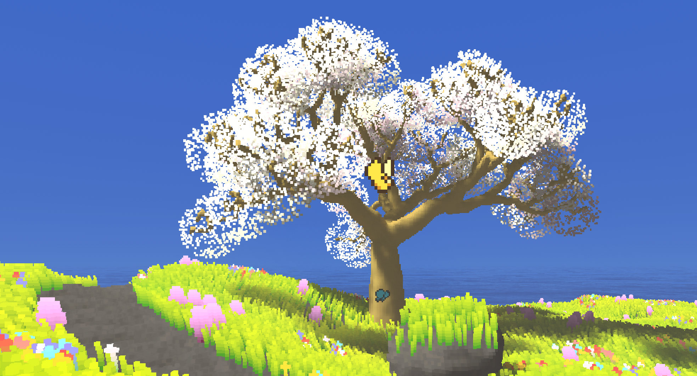

# Re: Flora

> Cultivate your own island ecosystem — a meditative voxel gardening game.



Re: Flora is a cozy voxel game prototype about shaping terrain, planting flora, and building a calm island atmosphere. Built with Vulkan ray tracing in Rust.

## Getting Started

**Prerequisites:**

- [Rust](https://rustup.rs/) (latest stable)
- Vulkan-capable GPU with up-to-date drivers (RTX not required)
- Vulkan development packages:
  - Linux: `libvulkan-dev` + `vulkan-tools` (or distro equivalent)
  - Windows: [Vulkan SDK](https://vulkan.lunarg.com/sdk/home#vulkansdk)

**Build and run:**

```bash
cargo run --release
```

The first build takes a while — shaders compile from source.

## Controls

Basic controls:

- **WASD** to move.
- **Space** to jump.
- **Shift** to sprint.
- **G** to toggle walk/fly mode.
- **E** to toggle the config panel.
- **Q** to quit.

Most values can be tuned live from the config panel. Runtime defaults are stored in [`config/gui.toml`](./config/gui.toml).

## Tech Stack

| Domain    | Crate                                      |
| --------- | ------------------------------------------ |
| Rendering | `ash` (Vulkan) with ray tracing extensions |
| Windowing | `winit`                                    |
| UI        | `egui`                                     |
| Audio     | `petalsonic`                               |
| Terrain   | `fastnoise-lite` + `noise`                 |

## Documentation

- [Technical references](./docs/references.md)
- [Inspirations and art direction](./docs/inspirations.md)
- [Roadmap](./ROADMAP.md)
- [Contributing](./CONTRIBUTING.md)

## Acknowledgements

- [egui-ash-renderer](https://github.com/adrien-ben/egui-ash-renderer) — `ash` + `egui` integration
- TheMaister, Khronos Group, and the broader graphics programming community for Vulkan guidance

## License

Dual-licensed:

- **Code:** [GPL-3.0](./LICENSE)
- **Assets** (art, audio, images, config): [CC BY-NC-SA 4.0](./LICENSE-ASSETS)
